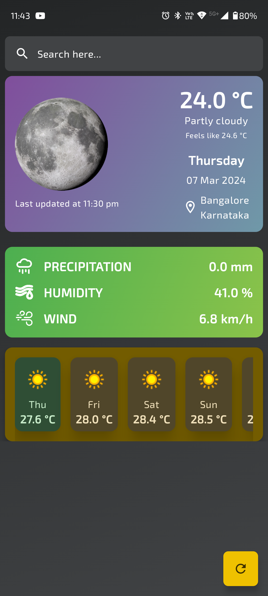

# WeatherNow

WeatherNow is a modern Android application built with Jetpack Compose that provides users with up-to-date weather information and periodic notifications. With a clean and intuitive user interface, WeatherNow offers a seamless experience for users to stay informed about the weather conditions in their area.

## Features

- **Real-time Weather Updates**: Get accurate and reliable weather forecasts for your current location.
  
- **Daily Forecasts**: Plan your week with daily weather forecasts, including detailed information such as temperature, humidity, wind speed, and more.
  
- **Location-Based Forecasting**: WeatherNow automatically detects your location to deliver personalized weather updates. You can also manually search for weather information in other locations.
  
- **Customizable Notifications**: Stay informed about changing weather conditions with customizable notifications for severe weather alerts. Notifications are sent periodically using Work Manager.

## Screenshots

<!-- 

 -->
<div style="display: flex; justify-content: space-between;">


</div>

## Getting Started

To get started with WeatherNow, follow these steps:

1. Clone the repository:  
``` git clone https://github.com/Srinivas1109/Weather-App.git ```

2. Open the project in Android Studio.

3. Build and run the app on an Android device or emulator.
